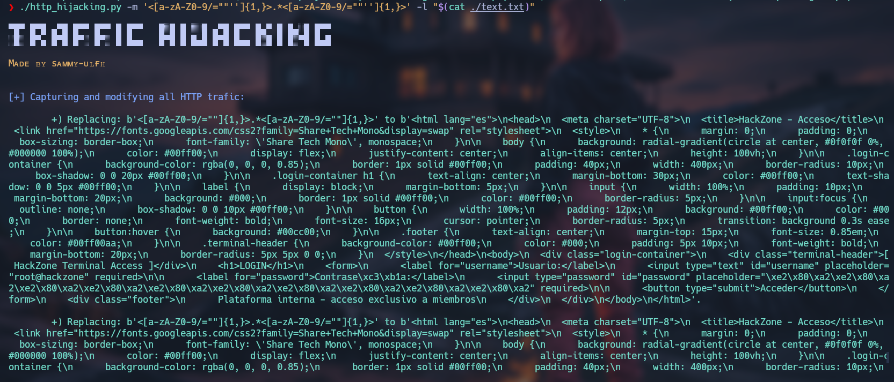
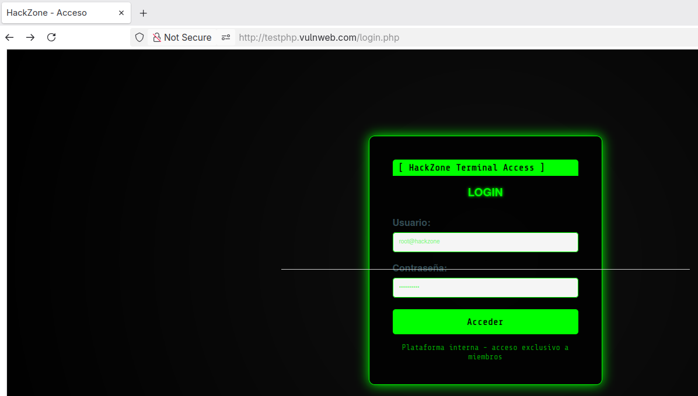

# Traffic Hijacking

<p align="center">
    
</p>

**HTTP Traffic Hijacking** is a tool that captures and modifies **HTTP** traffic from a target device. You can use it by providing the **match** argument to defone the patterns to search for, and the **loads** argument to specify the corresponding replacements - applying one-to-one substitutions for each match.

<p align="center">
    
</p>

## Table of contents

- [First stepts](#what-do-i-need-to-run-it)
- [Neccesarry steps before running](#how-does-it-work)
- [How to run it](#how-do-i-use-it)

## What do I need to run it?

1. First, clone the repository:

    ```git
    git clone https://github.com/sammy-ulfh/traffic_hijacking.git
    ```

2. Then, navigate to the **traffic_hijacking/script** directory.

3. Next, install required libraries using pip:

    ```pip3
    pip3 install -r requirements.txt
    ```
3. Finally, add some rules using the **iptables** tool:

    ```shell
    iptables -I INPUT -j NFQUEUE --queue-num 0
    iptables -I OUTPUT -j NFQUEUE --queue-num 0
    iptables -I FORWARD -j NFQUEUE --queue-num 0
    iptables --policy FORWARD ACCEPT
    ```
    <br/>
    Then, set the value 1 in the **ip_forward** file to enable ip forwarding:

    ```shell
    echo 1 > /proc/sys/net/ipv4/ip_forward
    ```
    <br/>
    All of these rules redirect the traffic to an NFQUEUE, and we can bind to the queue using its number - in this case 0.


## How does it work?

This **HTTP Traffic Hijacking** tool captures and modifies HTTP traffic when a target device attemps to retrieve the HTML content of an HTTP page, with the goal of modifying the page using regex-based patterns.

It was built to capture traffic while performing ARP spoofing, allowing you to intercept and analize all the traffic that your target is accessing. You can complement the **[arp_spoofer](https://github.com/sammy-ulfh/arp_spoofer)** tool with this one to capure all HTTP traffic from your target and apply replacements to specific parts of the HTML code.

How it works on your device:<br/>

<p align="center">
    
</p>

How it works on a target device:<br/>

<p align="center">
    
</p>


## How do I use it?

**NOTE:** Root privileges are required.

- **match:**
    Provide a one or many text that can be a match separated by '<#>' using the **-m / --match** argument.<br/>
    Example: -m ```"<title>.*</title>"```<br/>
    Example: -m ```"<title>.*</title><#><h1>.*</h1>"```

- **Replacements:**
    Provide replacements for each possible match using the **-l / --load** argument.<br/>
    Example: -m ```"<title>H4cked! ;D</title>"```<br/>
    Example: -m ```"<title>H4cked! ;D</title><#><h1>You have been hacked! ;D</h1>"```

